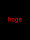

sinatra_placehold
=================

clone of [placehold.it](http://placehold.it)

`http://localhost:9292/100`

return


Options
--------------------------------

`http://localhost:9292/60x80/000/f00.png?text=hoge`

return



```text
http://localhost:9292/60x80/000/f00.png?text=hoge
                       ^     ^   ^   ^    ^
                       |     |   |   |     `- label (optional)
                       |     |   |    `- format (optional, default: png)
                       |     |    `- color (optional)
                       |      `- bgcolor (optional)
                        `- size(width x height) or width
```

Requirements
--------------------------------

* Ruby 1.9+
* ImageMagick

